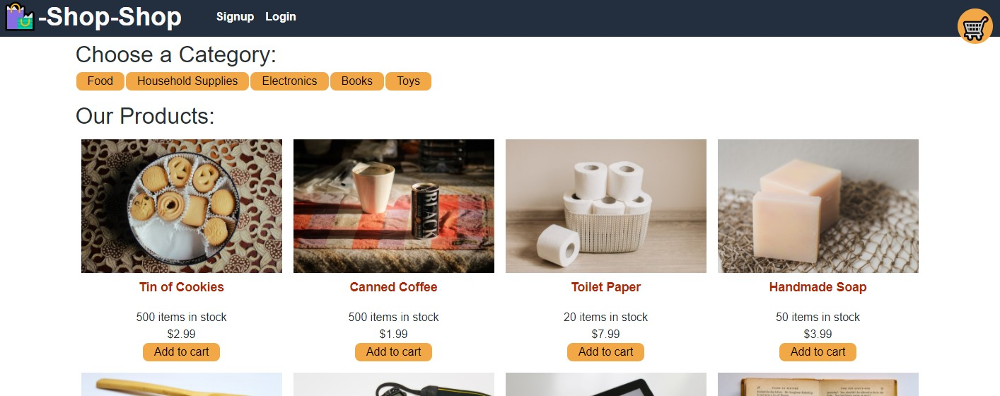
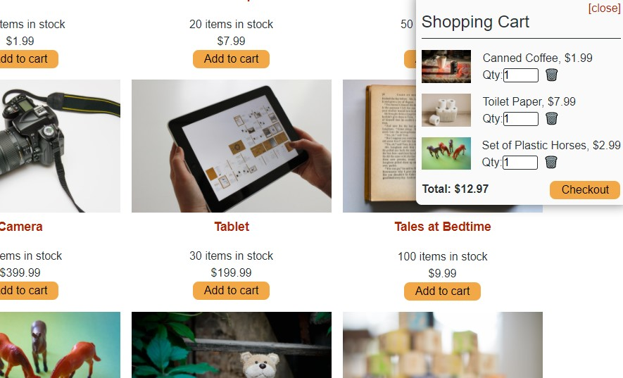
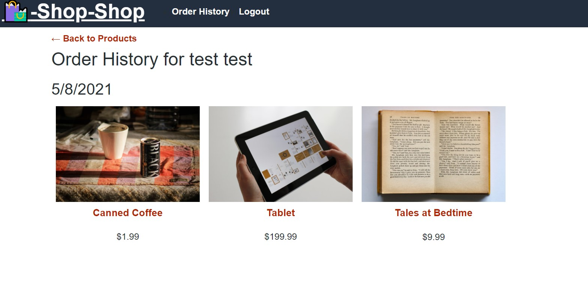

# Shop Shop Redux
A MERN Shopping website using Redux for state management

## Description
This is sample shopping website. It is a full stack MERN application. It uses Redux for global state management. 

It is based on the module project version of the Shop-Shop website that originally used the React Context API for state management.

Along with the use of Redux for state management, the app also uses indexedDB to allow for offline use by saving product and cart data locally. It also connects to a test only version of the Strip payment processing API to simulate checkout.

## Table of Contents
* [Installation](#Installation)
* [Usage](#Usage)
* [Technologies](#Technologies)
* [Preview](#Preview)

## Installation
No installation is necessary as the app is deployed to Heroku. 

However you can copy the repository and then run `npm i` if you want a local copy. 

## Usage
App is on Heroku at https://gentle-cliffs-54878.herokuapp.com/

## Technologies
This application was made using

## Preview

### Screenshots

Main Page

Shopping Cart

Order History

